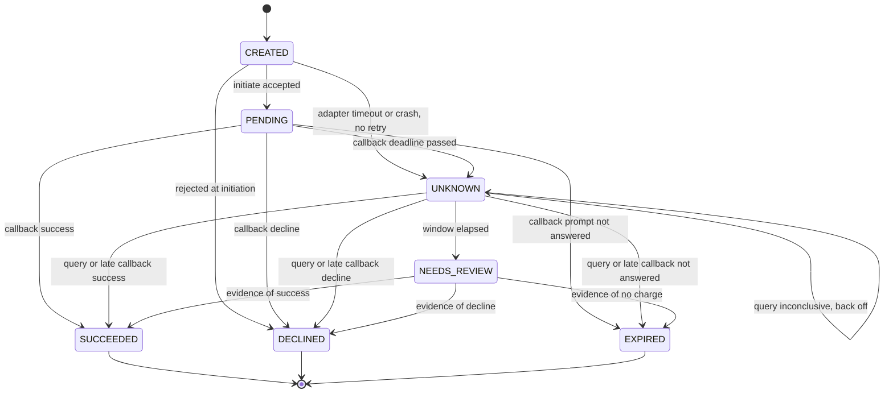

# ADR 0006 — Idempotency and callback replay safety

- **Status:** Proposed (G0 follow-up — for G2)
- **Date:** 2026-09-21
- **DRI:** Payments + integrity — Mitingi Joy Chesang (`@chesangJ`)
- **Related:** [ADR 0004](0004-mpesa-adapter.md) (adapter port and sandbox boundary), [ADR 0002](0002-rds-postgresql.md) (PostgreSQL, per-service schemas), [ADR 0007](0007-multi-tenancy.md) (tenant scope), [threat model](../threat-model.md)
- **Proof:** invariant tests in Payments driven by the FakeAdapter in `services/_shared/`

## Context

Timeouts are not declines. Callbacks may duplicate or reorder. Commission must never double-pay. The product contract ([architecture](../architecture.md), invariants 1-4) requires idempotent creates, timeout-stays-pending, one ledger effect per callback, and no double payout.

M-Pesa access is only through the adapter port ([ADR 0004](0004-mpesa-adapter.md)). Everything below is written against that port, so it is provable in CI with the FakeAdapter and never needs a real Daraja call.

**Scope.** This ADR decides the STK Push collection path (customer pays a sale). Commission B2C payouts reuse the same key, timeout and replay rules but have their own states and ledger; they are tracked as an open question below rather than decided here.

## Decision

### 1. Payment state machine

States:

| State | Meaning | Terminal |
|---|---|---|
| `CREATED` | Intent recorded in the DB. The provider call may or may not have been made. | No |
| `PENDING` | Provider accepted the initiate call and returned a provider reference. Waiting for the customer and the callback. | No |
| `UNKNOWN` | We do not know the outcome (timeout, missing or late callback, crash mid-call). Being reconciled. | No |
| `NEEDS_REVIEW` | Reconciliation window elapsed with no definitive answer. A human decides. | No |
| `SUCCEEDED` | Provider confirmed payment. Exactly one ledger credit exists. | Yes |
| `DECLINED` | Provider definitively reported a failure attributable to the attempt (cancelled, insufficient funds, wrong PIN, rejected at initiation). Carries a `decline_reason`. | Yes |
| `EXPIRED` | Closed with no charge and no customer decline, for example the prompt was never answered. | Yes |

**No `REVERSED` state.** The repo does not define reversals and ADR 0004 lists no reversal call. `SUCCEEDED` stays immutable. If reversals are needed later they are modelled as separate, append-only compensating ledger entries linked to the payment, not as a state change (see Open questions).

Transitions (every row is the only way to make that move):

| # | From | Event | To | Side effect |
|---|---|---|---|---|
| 1 | `CREATED` | Initiate accepted (provider reference returned) | `PENDING` | Store `provider_ref`; schedule callback deadline |
| 2 | `CREATED` | Initiate synchronously rejected by provider | `DECLINED` (`REJECTED_AT_INITIATION`) | None; no ledger entry |
| 3 | `CREATED` | Adapter timeout or network error after the attempt began, or worker crash (swept) | `UNKNOWN` | Schedule reconcile; **no retry of initiate** |
| 4 | `PENDING` | Callback: success | `SUCCEEDED` | Ledger credit + outbox event, one transaction |
| 5 | `PENDING` | Callback: definitive decline | `DECLINED` | Store reason and raw code; outbox event |
| 6 | `PENDING` | Callback: prompt not answered / unreachable | `EXPIRED` | Outbox event |
| 7 | `PENDING` | Callback deadline passed with no callback | `UNKNOWN` | Schedule reconcile |
| 8 | `UNKNOWN` | Status query or late callback: success | `SUCCEEDED` | Same ledger path as row 4 |
| 9 | `UNKNOWN` | Status query or late callback: definitive decline | `DECLINED` | As row 5 |
| 10 | `UNKNOWN` | Status query or late callback: not answered | `EXPIRED` | As row 6 |
| 11 | `UNKNOWN` | Query inconclusive or errored | `UNKNOWN` | Increment attempt count, schedule next backoff |
| 12 | `UNKNOWN` | Max reconcile window elapsed | `NEEDS_REVIEW` | Alert; **not** auto-failed |
| 13 | `NEEDS_REVIEW` | Late callback, query, or operator action with provider evidence | `SUCCEEDED` / `DECLINED` / `EXPIRED` | As rows 4-6; operator action records who and what evidence |

**Illegal transitions.** Anything not in the table is illegal. Terminal states are immutable: an event that would move a payment out of `SUCCEEDED`, `DECLINED` or `EXPIRED` to a different state is **rejected and logged, never applied**. Specifically:

- The handler writes an `illegal_transition` audit row (payment id, provider ref, from, event, payload hash) and emits a metric. It does not mutate the payment.
- For a callback the HTTP response is still 2xx (see section 4) so the provider stops retrying.
- A contradiction that could mean money moved (for example a success callback for a payment already `DECLINED` or `EXPIRED`) additionally raises a high-severity alert for manual review. It is never auto-credited and never silently ignored.
- A callback that repeats the outcome the payment already has is a **replay**, not an illegal transition, and is a silent no-op (section 4).

Transitions are enforced in code by a single transition function backed by this table, and in the DB by a `CHECK` on the `state` column plus the row lock in section 4. Only that function updates `state`.

### 2. Idempotency keys

- **Who generates it.** The caller of the Payments API. For an STK charge that is POS, once per payment attempt, sent as an `Idempotency-Key` header. Payments never invents a key for a client request. A client that wants to retry a failed (terminal) attempt uses a new key.
- **Scope.** `(tenant_id, operation, key)`. `operation` is a fixed string such as `charge.initiate`. Two tenants can use the same key value without colliding ([ADR 0007](0007-multi-tenancy.md)).
- **Format.** 16 to 64 characters, `[A-Za-z0-9_-]`, opaque. A UUIDv4 or ULID is the recommended shape. Anything else is a 400.
- **Enforcement.** A DB unique constraint, not app logic: `idempotency_keys` has `PRIMARY KEY (tenant_id, operation, idem_key)`. The first request inserts the row with `INSERT ... ON CONFLICT DO NOTHING`; only the request that actually inserted proceeds.
- **Fingerprint.** The row stores `request_fingerprint`, the SHA-256 of a canonical form of the semantic request fields (tenant, sale id, amount in minor units, currency, normalised MSISDN). Transport-only fields are excluded.
  - Same key, same fingerprint, completed: return the **original stored response** (status and body), with header `Idempotent-Replayed: true`. No provider call.
  - Same key, different fingerprint: **409** with error code `idempotency_key_payload_mismatch`. Nothing is executed.
- **In-flight duplicate.** Same key, same fingerprint, first request not finished (`status = IN_FLIGHT`): **409** `idempotency_in_flight` with `Retry-After`. The duplicate does not wait and does not execute. The payment row and idempotency row are created in the same transaction before the provider call, so a crashed winner leaves a `CREATED` payment. The sweeper moves it to `UNKNOWN` (row 3); it never re-calls the provider.
- **Retention.** Keys are kept for at least 7 days and never purged while the linked payment is non-terminal. This exceeds the 24 h reconcile window so a late client retry cannot look like a new request. These are initial values, tunable in config.
- **Second guard against expiry.** Independently of keys, a partial unique index allows at most one payment per `(tenant_id, sale_id)` whose state is not `DECLINED` or `EXPIRED`. A stale key replayed after purge therefore still cannot create a second live charge for the same sale. This needs a `sale_id` in the Payments request contract (Open questions).

### 3. Timeout is not a decline

A missing or late callback, a network timeout, or an adapter timeout moves the payment to `UNKNOWN` (rows 3 and 7). It is never recorded as `DECLINED`, and it never triggers a retry of the initiate call, because that could charge the customer twice.

- `DECLINED` is written only from a provider-authoritative result code. Our own timeouts are observations, not provider answers.
- **Fail-safe mapping.** A provider code we do not recognise maps to `UNKNOWN`, not `DECLINED`.
- **Adapter contract** ([ADR 0004](0004-mpesa-adapter.md)). The port distinguishes a definitive decline from an unknown outcome as different error types, so callers cannot conflate them.

**Reconciliation path.** A reconcile job calls the adapter's status query by `provider_ref` (never Daraja directly).

| Parameter | Initial value (config, revisit after k6) |
|---|---|
| Callback deadline (`PENDING` to `UNKNOWN`) | 90 s |
| Query schedule after entering `UNKNOWN` | +30 s, +1 m, +2 m, +5 m, +10 m, +30 m, +1 h, then hourly with jitter |
| Max window | 24 h, then `NEEDS_REVIEW` |
| At max window | Alert with payment id and provider ref. **Not auto-failed.** A human resolves with provider evidence (row 13). |

An "in progress" or errored query response is inconclusive (row 11), not a decline.

**Provider result mapping.** Partially verified on 2026-09-21 against the Daraja portal page for M-Pesa Express Query (saved copy of the page). That page documents `ResultCode` 0 (success) and 1032 (request cancelled by the user) and states that any other `ResultCode` means an error occurred or the transaction failed. Rows that page does not confirm stay marked to verify before G2 relies on them. The M-Pesa Express (STK Push) and callback pages were not captured. Codes not listed are `UNKNOWN`.

| Provider signal | Outcome | Payment result | Status |
|---|---|---|---|
| `ResultCode` 0 | Success | `SUCCEEDED` | Verified for the status query response (STK Query page). Confirm the same in callbacks |
| `ResultCode` 1 | Insufficient funds | `DECLINED` (`INSUFFICIENT_FUNDS`) | Verify against Daraja docs |
| `ResultCode` 1032 | Cancelled by user | `DECLINED` (`USER_CANCELLED`) | Verified for the status query response (STK Query page). Confirm the same in callbacks |
| `ResultCode` 2001 | Wrong PIN | `DECLINED` (`WRONG_PIN`) | Verify against Daraja docs |
| `ResultCode` 1037 | Prompt not answered / handset unreachable | `EXPIRED` | Verify against Daraja docs, including that it guarantees no charge |
| Synchronous rejection of the initiate request | Invalid request | `DECLINED` (`REJECTED_AT_INITIATION`) | Verify which responses are definitive |
| No callback, HTTP timeout, 5xx, network error, adapter timeout | Unknown | `UNKNOWN` | By design, not a provider code |
| Status query returns a non-zero `ResponseCode`, an error, or says the request is still processing | Unknown | stays `UNKNOWN` | Fail-safe by design. The STK Query page says a non-zero `ResponseCode` means an error occurred; the in-progress response itself is not documented there, verify |
| Any other `ResultCode` | Unknown | `UNKNOWN` | By design (fail-safe) |

**Verified query facts** (STK Query page): the status query is keyed by `CheckoutRequestID` and requires the shortcode, a password (base64 of shortcode, passkey and timestamp) and a timestamp. Its response returns `MerchantRequestID`, `CheckoutRequestID`, `ResponseCode`, `ResultCode` and `ResultDesc`. The reconcile job therefore needs the shortcode and passkey inside the adapter implementation, never in Commission or CI ([ADR 0004](0004-mpesa-adapter.md)).

The adapter normalises these to an outcome (`SUCCEEDED`, `DECLINED`, `EXPIRED`, `UNKNOWN`) plus a decline reason and the raw code. Payments and Commission never branch on raw codes.

**Initiate timeout has no provider reference.** If the initiate call times out we may not hold a provider reference. The status query requires `CheckoutRequestID` (verified), so a query is impossible and we cannot retry safely. Such a payment waits in `UNKNOWN`. If a callback later arrives for an unrecognised provider reference it goes to the unmatched-callback inbox (section 4) and is surfaced for review. It is never auto-credited to a guessed payment.

### 4. Callback replay equals exactly one ledger effect

Callbacks can arrive 0, 1 or N times and out of order.

- **Dedupe key.** The provider's request identifier for the STK request (`CheckoutRequestID`), stored as `provider_ref`. ADR 0004 does not name the identifier; this ADR uses `CheckoutRequestID`. The STK Query page confirms it is a global unique identifier of the checkout request and the key for status query. Still to verify from the callback docs: that it is present on every STK callback including failures. The receipt number (`MpesaReceiptNumber`, success only, unverified) is stored as a secondary reference.
- **One transaction.** The handler runs, in a single DB transaction:
  1. `SELECT ... FROM payments WHERE provider_ref = $1 FOR UPDATE` (serialises concurrent callbacks and the reconcile job for the same payment).
  2. Check the transition is legal (section 1). If the payment already holds this outcome, the transaction is a no-op.
  3. `INSERT` the ledger credit with `UNIQUE (provider, provider_ref, entry_type)` and `ON CONFLICT DO NOTHING`.
  4. Update `state`.
  5. `INSERT` the outbox event with `UNIQUE (payment_id, event_type)`. Notifications are sent from the outbox, so they inherit the same uniqueness.
  6. `COMMIT`.
- **Replays return 2xx, change nothing.** A replay gets 2xx so the provider stops retrying, and produces no second ledger entry, no second event and no second notification. The unique constraints make this true even if the row lock is somehow bypassed.
- **Response codes.** 2xx after durable handling of: a valid callback, a replay, or an unmatched provider reference (stored in the inbox). Non-2xx only for failed authenticity (rejected, nothing stored as a payment fact) and for transient server failure (so the provider can retry). Exact provider retry behaviour: verify against Daraja docs.
- **Raw callback log.** Every accepted callback body is appended to `provider_callbacks` (with `UNIQUE (provider_ref, payload_sha256)`) for audit and forensics. Contact data is masked before storage.
- **Late callback after timeout.** A payment in `UNKNOWN` or `NEEDS_REVIEW` with a known `provider_ref` takes the same transaction as an on-time callback (rows 8-10, 13). If the reconciler already resolved it, the callback finds a terminal state with the same outcome and is a no-op, so the customer is credited once whichever of callback or query wins.
- **Callback authenticity.** Money transitions never trust the body alone ([threat model](../threat-model.md)). The handler checks:
  1. The request passes the authenticity check for the provider (mechanism is an open question; see below).
  2. The `provider_ref` matches a payment in a non-terminal state (otherwise: replay, illegal transition, or unmatched inbox).
  3. The amount in the callback equals the stored payment amount. Mismatch goes to `NEEDS_REVIEW` with an alert, not `SUCCEEDED`.
  4. Optionally, for `SUCCEEDED`, a confirming status query through the adapter before commit (config flag; cost is one extra call per payment).
- **Simulation in the FakeAdapter.** No real Daraja calls. The FakeAdapter signs each emitted callback with an HMAC over the body using a fixed, public test key and rejects callbacks whose signature does not match. This is a **stand-in** that exercises the verify-then-parse code path and the authenticity-failure branch. It does not claim to model how Daraja authenticates callbacks. It also emits duplicate, delayed, out-of-order and unmatched callbacks on documented magic inputs (see `services/_shared/README.md`).

### 5. Test and verification plan

All tests use the FakeAdapter and a real PostgreSQL (unique constraints and row locks must be real, not mocked).

| # | Invariant | Check |
|---|---|---|
| I1 | Replay N times gives one ledger row | Deliver the same callback N times: 1 ledger row, 1 outbox event, 1 notification, every response 2xx |
| I2 | Same key, different payload | 409 `idempotency_key_payload_mismatch`, no second payment, no adapter call |
| I3 | Same key, same payload | Original stored response returned, adapter call count still 1 |
| I4 | Timeout then late success gives one credit | Callback deadline passes, payment `UNKNOWN`, late callback and reconcile query both arrive: exactly one credit |
| I5 | Concurrent duplicate requests give one charge | N parallel requests with one key: 1 payment, FakeAdapter initiate count 1, the rest get replay or in-flight 409 |
| I6 | Timeout is never a decline | Property test over every timeout path (initiate timeout, no callback, query error): state is never `DECLINED` |
| I7 | Terminal states are immutable | For every terminal state and every event, state is unchanged and an `illegal_transition` row is written |
| I8 | Contradicting callback | Success then stale failure: stays `SUCCEEDED`. Failure then success: stays `DECLINED`, high-severity alert raised |
| I9 | Unknown result code fails safe | Unrecognised code leaves the payment `UNKNOWN` |
| I10 | Max window escalates | With the clock advanced past the window, payment is `NEEDS_REVIEW`, not `DECLINED` |
| I11 | Initiate timeout is not retried | Initiate timeout followed by sweeper and reconciler: adapter initiate count stays 1 |
| I12 | Second live payment for a sale rejected | New key, same sale, first payment non-terminal or `SUCCEEDED`: rejected |

**k6 scenario outline (FakeAdapter only, never Daraja).**
- Setup: point Payments at the FakeAdapter; seed tenants; use the documented magic MSISDNs.
- Scenario A, steady mix (stepped, then 15 min or longer soak): ~90% success, ~4% each insufficient funds and cancelled, ~2% timeout.
- Scenario B, replay storm: successful payments whose callbacks are replayed 3x to 10x, interleaved.
- Scenario C, duplicate submit: each iteration sends the same `Idempotency-Key` twice concurrently.
- Scenario D, timeout then late success: no callback, then a late callback and reconcile.
- Checks and thresholds: every replay response is 2xx; after the run, `count(ledger credits) == count(SUCCEEDED payments)` and no `provider_ref` has more than one credit (SQL assertion); zero payments `DECLINED` from a timeout scenario; p95 latency thresholds are set from the SLO doc once smoke results exist.

## Consequences

- **Correct by construction.** Duplicate charge and duplicate credit are prevented by DB constraints, not only by code review.
- **Storage cost.** Idempotency rows (with stored responses), the raw callback log and audit rows grow with volume. Bounded by the retention above and by masking contact data.
- **Reconciliation lag.** A timed-out payment can stay `UNKNOWN` for minutes to hours. Customers and attendants see "pending" longer than a decline would take. That is the accepted price of never double-charging or wrongly declining a paid sale.
- **Manual toil.** `NEEDS_REVIEW` needs a human process and a runbook entry.
- **SLO interaction.** The Payments SLO counts callback or reconcile terminal within 60 s ([SLOs](../slo-error-budgets.md)). `UNKNOWN` resolution can exceed that, so the exclusions or the measurement must be aligned (Open questions).
- **Extra guard costs.** The one-live-payment-per-sale index couples Payments to POS's sale identifier.
- **Tests need real PostgreSQL** for the concurrency and constraint invariants, which makes CI heavier.

## Alternatives considered

| Option | Rejected because |
|---|---|
| App-level idempotency only (check-then-insert) | Racy under concurrency; constraint must be in the DB |
| Treat timeout as decline and let the customer retry | Can double-charge when the first prompt was actually paid |
| Auto-retry initiate on timeout | Same double-charge risk; the provider is not known to dedupe by our key (verify) |
| Auto-fail after the max window | Could mark a paid sale failed; escalate to a human instead |
| Blocking wait on in-flight duplicates | Ties up workers; a 409 with `Retry-After` is simpler and safe |
| Dedupe on the receipt number only | Absent on failure callbacks; the request identifier is on every callback |
| Distributed lock (Redis) instead of row lock | Adds a failure mode; PostgreSQL row lock plus unique constraints already give the guarantee |
| `REVERSED` payment state | Would break terminal immutability; use compensating ledger entries if needed |

## Open questions

| # | Question | Owner |
|---|---|---|
| 1 | Real Daraja callback authenticity mechanism in the sandbox (signature, source allowlist, secret path). Tracked as an open risk in the [threat model](../threat-model.md); target G2 | `@chesangJ` |
| 2 | Partly closed 2026-09-21: `ResultCode` 0 and 1032 and the query request and response fields are verified (STK Query page). Still to verify from the STK Push and callback pages: codes 1, 2001 and 1037, the in-progress query response, and that `CheckoutRequestID` is on all STK callbacks | `@chesangJ` |
| 3 | Query needs `CheckoutRequestID` (verified), so an initiate-timeout payment cannot be queried. Still open: whether callbacks echo any caller-supplied reference so it can be matched safely | `@chesangJ` |
| 4 | Reversals: ADR 0004 lists no reversal. If needed, decide the compensating-entry model and amend ADR 0004 | `@chesangJ` |
| 5 | B2C payout (Commission) state machine and ledger key; reuses these rules but needs its own section or ADR | `@chesangJ` |
| 6 | Payments request contract carries `sale_id`, and POS guarantees it is unique per sale | `@Moraaalice` |
| 7 | Tenant scoping of keys depends on ADR 0007 landing | `@Moraaalice` |
| 8 | Align the 60 s Payments SLO with `UNKNOWN` resolution time | `@emebetgirmay` |
| 9 | Scheduling mechanism for the reconcile job (for example SQS delay or EventBridge); infra is out of scope for this ADR | `@emebetgirmay` |
