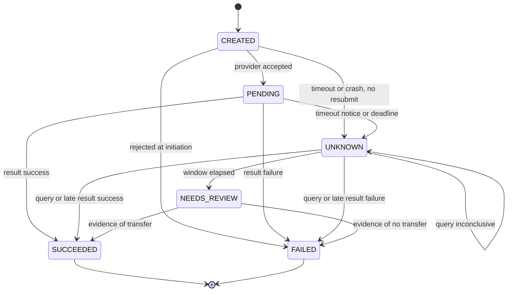

# ADR 0008 - B2C commission payouts

- **Status:** Proposed (draft for G2)
- **Date:** 2026-09-21
- **DRI:** Payments + integrity, Mitingi Joy Chesang (`@chesangJ`)
- **Related:** [ADR 0004](0004-mpesa-adapter.md) (adapter port and sandbox boundary), [ADR 0006](0006-idempotency-replay.md) (keys, timeout and replay rules this ADR reuses), [ADR 0002](0002-rds-postgresql.md) (PostgreSQL), [ADR 0007](0007-multi-tenancy.md) (tenant scope), [architecture](../architecture.md), [SLOs](../slo-error-budgets.md), [threat model](../threat-model.md)
- **Proof:** invariant tests in Commission and Payments driven by the FakeAdapter in `services/_shared/`

## Context

A daily Commission run turns **confirmed paid** sales into payouts to attendants via M-Pesa B2C. The product contract ([architecture](../architecture.md), invariant 4) says replay never double-pays, and the [SLO](../slo-error-budgets.md) makes a duplicate disbursement for one ledger row a P0 with a target of zero. Money leaves the business here, so the dangerous failure is paying twice; being late is the cheaper failure.

Boundaries that already hold and are not reopened: Commission never calls Daraja, only the Payments adapter does ([ADR 0004](0004-mpesa-adapter.md)); a timeout is never a decline and is never retried blindly ([ADR 0006](0006-idempotency-replay.md)); CI and k6 use the FakeAdapter only.

**Source notes.** Written against saved copies of the Daraja portal pages for B2C, B2C Hakikisha, Transaction Status, Reversals and Getting Started (reviewed 2026-09-21). Items the pages do not state are marked "verify" and listed in Open questions.

Documented facts this ADR relies on (B2C page unless noted):

- **Request.** Endpoint `/mpesa/b2c/v3/paymentrequest`. Fields include a caller-supplied `OriginatorConversationID`, `CommandID`, `Amount`, `PartyA` (the B2C short code), `PartyB` (recipient MSISDN), `ResultURL` and `QueueTimeOutURL`. The API is asynchronous: an acknowledgement now, the result later at the `ResultURL`; the `QueueTimeOutURL` is notified "if the payment request times out while awaiting processing".
- **Provider-side double-pay guard.** `OriginatorConversationID` is "generated by the merchant system for every B2C request to avoid double disbursement" and can be used to query status "before making another disbursement". A sample error, `500.002.1001` "Duplicate OriginatorConversationID.", shows a repeated id is rejected.
- **Command types.** `BusinessPayment` (normal payment, registered M-PESA customers only), `SalaryPayment`, `PromotionPayment` (congratulatory message). An unregistered recipient is rejected (result code 2040).
- **Limits (FAQ).** Minimum KSh 10, maximum KSh 250,000 per transaction, customer daily limit KSh 500,000, customer maximum balance KSh 500,000.
- **Funding.** B2C debits the **Utility** account, not the Working account. Money can be moved to it in the M-PESA portal (a second operator approves), with the B2B API command `BusinessTransferFromMMFToUtility` (needs whitelisting by API support), or with the B2C Account Top Up API.
- **No API reversal and no approval gate.** B2C transactions cannot be reversed with the Reversal API; that is a manual portal action. API-initiated B2C needs no manual approval.
- **Credentials.** The API user needs the "ORG B2C API Initiator" role, and the security credential is the initiator password encrypted with the M-Pesa public certificate (RSA, PKCS #1.5 padding, base64; sandbox and production certificates differ). The same security credential may be reused across requests. Multiple failed attempts lock the API user (result code 8006) until the Business Administrator unlocks it. No passkey is needed for B2C.
- **Results.** Callbacks come from a documented list of gateway IP addresses, and the gateway "logs a 503 error and discards the results" when our endpoint is down (Getting Started). The result carries `OriginatorConversationID`, `ConversationID` and `TransactionID`; a success also carries the receipt, amount, completion time, the recipient's name and phone number, and the B2C account balances.
- **Reconciliation.** The Transaction Status API can query B2C transactions by `OriginatorConversationID` or receipt number (FAQ), and is asynchronous.
- **Hakikisha.** The B2C Hakikisha page describes a synchronous identity check (phone number and short code in, first name plus masked middle and last names out). It needs a signed contract and Safaricom approval, offered under a reciprocal agreement with the C2B Hakikisha API.
- **Fees.** A Transaction Status sample result for a B2C payment shows a per-payment charge ("Fee For B2C Payment", a sample value), which favours one aggregated payout per attendant per day over paying on each sale.

## Decision

### 1. Ownership split

| Concern | Owner | Never |
|---|---|---|
| What is owed: eligibility, amounts, the payout ledger | Commission | Call Daraja or hold Daraja credentials |
| Sending money: disbursement state, adapter call, provider references, reconciliation | Payments | Decide amounts or eligibility |
| Provider access | Payments adapter only ([ADR 0004](0004-mpesa-adapter.md)) | Be reachable from Commission or CI |

Commission asks Payments to disburse through `POST /v1/disbursements` with an `Idempotency-Key`. Commission advances a payout to paid or failed only from the disbursement status Payments reports, never by inference.

### 2. Eligibility and the payout ledger

- **Eligible sales:** only sales whose payment is `SUCCEEDED` ([ADR 0006](0006-idempotency-replay.md)) and that have no successful reversal. Anything else is excluded and stays eligible for a later day if it becomes confirmed.
- **Amounts:** integer minor units, computed by Commission from rules owned by Product (Open questions).
- **One payout per attendant per business day:** `payout_ledger` has `UNIQUE (tenant_id, attendant_id, business_date)`. The business date is an EAT calendar day.
- **A sale is paid at most once:** `payout_items` has `UNIQUE (sale_id)` linking sales to their payout, so a sale cannot land in two payouts even if the run is replayed or a rule changes.
- **Recipient snapshot:** the payout row stores the MSISDN and amount when it is `PLANNED`. A replay reads the snapshot, so a later change to the attendant record cannot redirect money already planned.
- **Command type and recipient:** payouts use `BusinessPayment`, which supports only registered M-PESA customers, so attendants must be registered (an unregistered number is rejected). Optionally, B2C Hakikisha can confirm the name behind a number before the first payout (contract and Safaricom approval needed; not a G2 dependency).
- **Run schedule:** an EventBridge schedule starts the run for the previous business day early enough to leave time for disbursement and reconciliation before the 06:30 EAT SLO deadline. The exact time is an open question. The run message may be delivered more than once (SQS is at-least-once); every write above is constraint-protected, so redelivery changes nothing.

Payout ledger status, advanced by Commission from Payments' reported status:

`PLANNED` (computed, items linked) to `REQUESTED` (disbursement created) to `PAID` or `FAILED` (both terminal). While Payments reports `UNKNOWN` or `NEEDS_REVIEW` the ledger row stays `REQUESTED`.

### 3. Idempotency

- **Key derivation.** Commission derives the key from the payout row, for example `po_` plus the payout row's UUID, so a replayed run produces the **same key**, not a new one. It fits [ADR 0006](0006-idempotency-replay.md) (16 to 64 characters, `[A-Za-z0-9_-]`) with scope `(tenant_id, disbursement.create, key)`.
- **Fingerprint.** Recipient, amount, currency and payout id. Same key with a different payload returns a 409 and sends nothing.
- **Provider identifier chosen by us.** Payments derives the B2C `OriginatorConversationID` deterministically from the disbursement id and **stores it in the row before the provider call**. So even if the response is lost, the disbursement can be reconciled by that id (unlike an STK request, where the provider issues the reference), and the provider itself rejects a repeat of the same id. Keep it to 20 characters or fewer until the sandbox shows longer ids are accepted (the page's request sample is longer than the limit its response table states).
- **A duplicate-id error is not a failure.** A synchronous `500.002.1001` "Duplicate OriginatorConversationID." means an earlier attempt with that id exists and may have paid. It moves the disbursement to `UNKNOWN` and reconciles by that id; it never becomes `FAILED` and never triggers a new id.
- **Structural guard beyond keys.** A partial unique index allows at most **one disbursement per payout row whose state is not `FAILED`**. Even a stale key replayed after retention cannot create a second live disbursement for the same payout.
- **No automatic resubmission.** A `FAILED` payout is re-queued only by an operator, after checking the previous attempt's provider evidence, and the new attempt gets a new key and a new disbursement. Nothing retries a payout on its own in G2.

### 4. Disbursement state machine (Payments)

Same shape as [ADR 0006](0006-idempotency-replay.md), with `FAILED` in place of the customer-facing `DECLINED` and `EXPIRED` (no customer is prompted).

| State | Meaning | Terminal |
|---|---|---|
| `CREATED` | Intent recorded. The provider call may or may not have been made. | No |
| `PENDING` | Provider accepted the request and returned its identifiers. Waiting for the result. | No |
| `UNKNOWN` | Outcome not known (timeout, timeout notification, missing or late result, crash). Being reconciled. | No |
| `NEEDS_REVIEW` | Reconciliation window elapsed with no definitive answer. A human decides. | No |
| `SUCCEEDED` | Provider confirmed the transfer. Receipt stored; one ledger effect. | Yes |
| `FAILED` | Provider definitively reported that no money moved, with a reason. | Yes |

| # | From | Event | To | Side effect |
|---|---|---|---|---|
| 1 | `CREATED` | Provider accepts the request | `PENDING` | Store `ConversationID` (our `OriginatorConversationID` is already stored) |
| 2 | `CREATED` | Synchronous definitive rejection (a documented client error, not a duplicate-id error) | `FAILED` | None; alert if the cause is credentials or configuration |
| 3 | `CREATED` | Adapter timeout, crash after the attempt began, or a synchronous "Duplicate OriginatorConversationID" error | `UNKNOWN` | Schedule reconcile by our `OriginatorConversationID`; **never resubmit** |
| 4 | `PENDING` | Result callback: success | `SUCCEEDED` | Disbursement ledger entry + outbox event, one transaction |
| 5 | `PENDING` | Result callback: definitive failure | `FAILED` | Store reason and raw code; outbox event |
| 6 | `PENDING` | Timeout notification, or result deadline passed | `UNKNOWN` | Schedule reconcile |
| 7 | `UNKNOWN` | Transaction Status result or late result: success or failure | `SUCCEEDED` / `FAILED` | As rows 4 and 5 |
| 8 | `UNKNOWN` | Query inconclusive or errored | `UNKNOWN` | Next backoff |
| 9 | `UNKNOWN` | Max window elapsed | `NEEDS_REVIEW` | Alert; **not** auto-failed |
| 10 | `NEEDS_REVIEW` | Late result, query, or operator action with provider evidence | `SUCCEEDED` / `FAILED` | As rows 4 and 5; records who and what evidence |

Terminal states are immutable. An illegal transition is rejected and logged, never applied. A result that contradicts a terminal state is high severity: a `FAILED` disbursement that later reports success means money may have moved, so it raises a P0 alert for manual reconciliation and is never auto-corrected.

### 5. Results, timeouts and reconciliation

- **Result handling** follows [ADR 0006](0006-idempotency-replay.md) section 4: verify the source (documented IP allowlist), then one transaction that locks the disbursement row, checks the transition, inserts the ledger entry with `UNIQUE (provider, originator_conversation_id)`, updates state and inserts the outbox event. Replays return 2xx and change nothing.
- **Dedupe key** is our `OriginatorConversationID`, with the receipt number (`TransactionID`, also `TransactionReceipt` on success) as a secondary unique reference. B2C results carry `OriginatorConversationID`, `ConversationID` and `TransactionID` (documented).
- **A timeout notification is not a failure.** The result and the timeout notification use separate URLs (`ResultURL`, `QueueTimeOutURL`). The page says the timeout URL is notified when the request "times out while awaiting processing", which does not say the transfer was refused, so it moves the disbursement to `UNKNOWN`, not `FAILED`.
- **Lost callbacks are expected.** The gateway discards results sent while our endpoint is down, so the reconciler is the recovery path, not a rare edge case.
- **Reconcile path:** the Transaction Status API keyed by `OriginatorConversationID`. It is asynchronous, so the reconcile job submits a status request (its own idempotent operation) and waits for its result callback. Read the `TransactionStatus` result parameter, not the query's own `ResultCode` (see [ADR 0006](0006-idempotency-replay.md)).
- **Schedule:** the ADR 0006 backoff, with a 24 h max window before `NEEDS_REVIEW`. An alert fires at 06:30 EAT for any payout not yet terminal.
- **Result codes** are documented for B2C and apply to B2C only; the STK table in [ADR 0006](0006-idempotency-replay.md) must never be reused (code 2001 is "initiator information is invalid" here). A non-zero `ResultCode` is documented as failure. The page types `ResultCode` as a string but shows numbers in samples, so the adapter accepts both.

| ResultCode | Documented meaning | Disbursement result |
|---|---|---|
| 0 | Processed successfully | `SUCCEEDED` |
| 1 | Balance insufficient in the B2C Utility account | `FAILED` (`INSUFFICIENT_FUNDS`) |
| 2 | Amount below the allowed minimum | `FAILED` (`AMOUNT_TOO_LOW`) |
| 3 | Amount above the allowed maximum | `FAILED` (`AMOUNT_TOO_HIGH`) |
| 4, 8 | Would exceed the customer's daily transfer limit or maximum balance | `FAILED` (`RECIPIENT_LIMIT`) |
| 2040 | Customer type not supported (recipient not registered) | `FAILED` (`RECIPIENT_NOT_REGISTERED`) |
| `SFC_IC0003` | Phone number invalid or not on M-PESA ("The operator does not exist") | `FAILED` (`RECIPIENT_INVALID`) |
| 11, 2006 | B2C account not active | `FAILED` (`ACCOUNT_STATE`), alert |
| 21, 2001, 2028, 8006 | Initiator lacks the role, initiator information invalid, short code lacks B2C permission, security credential locked | `FAILED` (`CONFIGURATION`), alert and trip the kill switch |
| any other | Not documented | `UNKNOWN` |

The pages describe these as declines by M-PESA, but do not state that no money can have moved; confirm in the sandbox contract test (Open questions) before relying on `FAILED` in production. The gate from ADR 0006 applies: only codes present in this table are terminal.

### 6. Money safety controls

- **Credentials.** A dedicated API user with only the B2C initiator role, in its own secret, used only by the Payments adapter. The security credential is produced inside the adapter with the environment's certificate and may be reused across requests. Nothing in Commission, CI, k6, fixtures or git. Repeated bad credentials lock the API user (code 8006) and stop every payout until the Business Administrator unlocks it, so a `CONFIGURATION` result (codes 21, 2001, 2028, 8006) trips the kill switch automatically and nothing retries.
- **Ceilings and provider limits.** Per-payout and per-run maximums, set in configuration and never above the provider's KSh 250,000 per-transaction maximum. A payout below the KSh 10 minimum is carried forward, not sent. A payout above a ceiling is held for review and not split automatically in G2.
- **No undo, no provider approval.** B2C cannot be reversed with the API, and API-initiated B2C needs no manual approval. A wrong payout can only be recovered by hand in the M-PESA portal, so the controls here (snapshot, ceilings, kill switch, no resubmission) are the only protection before money leaves.
- **Sensitive results.** A success result carries the recipient's name and phone and the B2C account balances. Store only the receipt, amount, time and our ids; keep names, phone numbers and balances out of logs and raw-result storage, or mask them, with a short retention.
- **Kill switch.** A Payments configuration flag stops all sends without a deploy. Disbursements created while it is off stay `CREATED` and are picked up when it is re-enabled, never re-sent from scratch (their keys are unchanged).
- **No manual double B2C.** The runbook already says so; operators resolve `NEEDS_REVIEW` with evidence, never by re-sending.
- **Funding.** B2C debits the **Utility** account, not the Working account. A code 1 result is a definitive `FAILED` for that payout; the run then pauses the remaining sends and alerts instead of sending the rest into the same failure. Nothing retries it in a loop. Moving money to the Utility account is an operational step (portal, B2B or Top Up API), outside G2.

### 7. Port and FakeAdapter extension

Follow-up implementation, not part of this ADR's change. Add to `MpesaPort` (and amend [ADR 0004](0004-mpesa-adapter.md)):

- `disburse(request) -> DisbursementAccepted` (takes the idempotency key and the deterministic `OriginatorConversationID`)
- `query_disbursement_status(originator_conversation_id) -> DisbursementStatus`
- `parse_disbursement_result(headers, body) -> DisbursementEvent`

with the same decline-versus-unknown error split. FakeAdapter magic-recipient scenarios: success, insufficient funds, invalid recipient, timeout with no result, timeout notification then late success, delayed result, duplicate result, and out-of-order results.

### 8. Test and verification plan

Real PostgreSQL, FakeAdapter only.

| # | Invariant | Check |
|---|---|---|
| P1 | Replaying the daily run N times pays each payout once | Payout rows, disbursements and adapter calls do not grow |
| P2 | Concurrent runs or workers pay once | Two parallel runs for one day: one disbursement per payout |
| P3 | A sale is paid at most once | Insert of a second `payout_items` row for a sale fails |
| P4 | Crash between `PLANNED` and `REQUESTED`, and between `CREATED` and the provider call | Restart sends exactly once or leaves `UNKNOWN`; never a second send |
| P5 | Timeout then late success gives one `SUCCEEDED` | No resubmission; one ledger entry |
| P6 | Duplicate and out-of-order results | One effect; contradiction raises the P0 alert and changes nothing |
| P7 | Timeout notification is not a failure | State is `UNKNOWN`, never `FAILED` |
| P8 | Unknown provider code fails safe | Stays `UNKNOWN` |
| P9 | Stale key after retention | The partial unique index still blocks a second live disbursement |
| P10 | Snapshot is honoured | Changing the attendant MSISDN after `PLANNED` does not change the recipient |
| P11 | Reversed or unconfirmed sales are excluded | Not in any payout |
| P12 | Ceilings and kill switch | Over-ceiling payout is held; switch off sends nothing |
| P13 | Sum check | Sum of `SUCCEEDED` disbursements equals the sum of paid payout rows per run |
| P14 | Duplicate `OriginatorConversationID` error | State is `UNKNOWN`, never `FAILED`; reconciled by the same id; no new id |
| P15 | Configuration result codes | 21, 2001, 2028 or 8006 sets `FAILED` (`CONFIGURATION`), trips the kill switch, and no further sends occur |
| P16 | Provider limits | Below KSh 10 is carried forward; above the ceiling is held; code 1 pauses the rest of the run |
| P17 | Result code table | Codes outside the table stay `UNKNOWN`; the STK table is not used for B2C |

**k6 outline (FakeAdapter only):** seed many tenants and attendants with confirmed sales; run the close repeatedly and in parallel; inject each fake scenario; then assert by SQL that no payout row has more than one non-`FAILED` disbursement, no sale appears twice, and no `provider_ref` has more than one ledger entry. Thresholds come from the SLO doc once smoke results exist.

## Consequences

- **Duplicate payout is prevented by constraints**, not only by code review: keys derived from the payout row, a unique index on non-failed disbursements, and a unique index on sale ids.
- **Aggregating per attendant per day** reduces per-payment charges and calls, at the cost of attendants being paid the next morning rather than instantly.
- **Some payouts will miss 06:30 EAT.** An `UNKNOWN` payout is not terminal, so it counts against the Commission SLO. Never auto-failing or resubmitting is the accepted price.
- **Manual toil.** `NEEDS_REVIEW` and operator-initiated retries need a runbook entry and an evidence source (the M-PESA Organization Portal, documented as offering transaction management and reconciliation).
- **Extra state and tables** in Payments (`disbursements`, results, outbox) and Commission (`payout_ledger`, `payout_items`), plus storage for raw results.
- **Two independent reconcile paths** exist for B2C (results and Transaction Status), so both must be idempotent against the same constraints.
- **Payouts are irreversible through the API.** A mistaken payout needs a manual portal reversal, so prevention matters more than recovery.
- **A credential mistake can halt all payouts** by locking the API user, which is why configuration errors trip the kill switch.

## Alternatives considered

| Option | Rejected because |
|---|---|
| Commission calls Daraja directly | Forbidden by the brief and [ADR 0004](0004-mpesa-adapter.md); would spread the money-moving credential |
| Pay on every sale in real time | Many small B2C calls, each with its own charge, and no natural daily reconciliation point |
| One B2C call for a whole tenant | B2C targets a single recipient; per-attendant payouts keep each ledger row mapped to one transfer |
| Automatic retry after a failure or timeout | Risks paying twice when the first attempt actually succeeded; only explicit operator retries after evidence |
| Generate a fresh key on every run | Defeats replay safety; the key must derive from the payout row |
| Distributed lock for the daily run | Adds a failure mode; unique constraints and row locks already give the guarantee |
| Dedupe on receipt number only | Absent until success; we choose the `OriginatorConversationID` before the call, and the provider rejects a repeat |

## Open questions

| # | Question | Owner |
|---|---|---|
| 1 | Partly closed 2026-09-21: the B2C page is reviewed (fields, caller-supplied `OriginatorConversationID`, duplicate error, result codes, limits, callback shape). Still to verify in the sandbox contract test run by the deployed adapter: the accepted length of `OriginatorConversationID`, whether decimal amounts are accepted, the time zone of `TransactionCompletedDateTime`, whether a result can follow a timeout notification, and that no documented failure code can coexist with a completed transfer | `@chesangJ` |
| 2 | Amend [ADR 0004](0004-mpesa-adapter.md) to add the disbursement and Transaction Status methods to `MpesaPort` | `@chesangJ` |
| 3 | Commission rules: rate, rounding, carry-forward of payouts below KSh 10, and who bears the per-payment B2C charge. A reversal that arrives after payout cannot be clawed back by API, so decide the netting policy | `@Moraaalice` |
| 4 | Business day definition (EAT cutoff, tills open across midnight), the attendant MSISDN source and change controls, and whether to adopt B2C Hakikisha for name checks (needs a signed contract, Safaricom approval and a reciprocal C2B Hakikisha agreement) | `@Moraaalice` |
| 5 | Run schedule time so payouts can reach terminal before 06:30 EAT (EventBridge is Platform's) | `@emebetgirmay` |
| 6 | Align the Commission SLO with payouts left `UNKNOWN` at 06:30 EAT; add runbook entries for the kill switch, a locked API user, and `NEEDS_REVIEW` | `@emebetgirmay` |
| 7 | Funding: alarm on the B2C Utility account balance (results carry balances; a Balance Query API role exists) and how the Utility account is topped up (portal, B2B `BusinessTransferFromMMFToUtility` after whitelisting, or the B2C Account Top Up API). The alarm and top-up automation are Platform's; the adapter method is Payments' | `@emebetgirmay` |
| 8 | Separate API user and secret for the B2C role (same point as [ADR 0006](0006-idempotency-replay.md) open question 12) | `@emebetgirmay` |
| 9 | Ceiling values (within the KSh 250,000 provider maximum) and who approves changes to them | `@chesangJ` with `@Moraaalice` |
